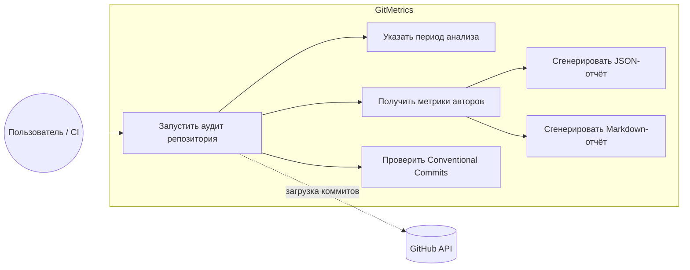
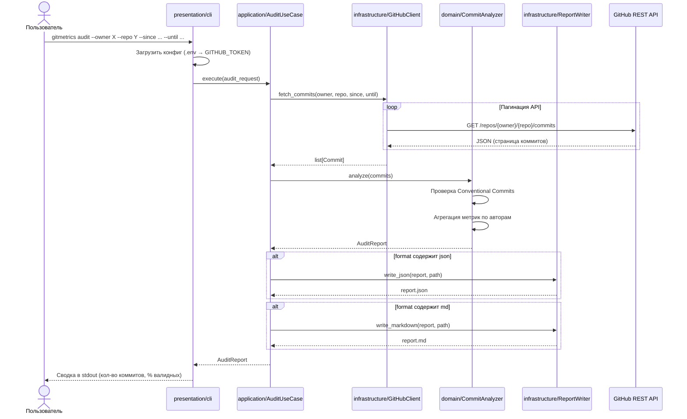
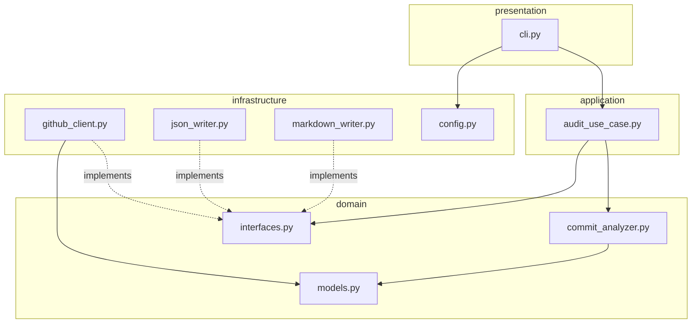

# Контрольная точка №1

**Название проекта:** GitMetrics — утилита аудита активности репозитория

**Команда / Разработчик:**
| Участник | Роль |
|---|---|
| Володин Никита Денисович | Архитектор / DevOps |
| Ракшин Егор Дмитриевич | Backend-разработчик |
| Бадмаев Богдан Григорьевич | QA / Инженер по тестированию и логированию |

---

## 1. Архитектурный план и концепция

### Цель сервиса

GitMetrics — консольная утилита для аудита активности Git-репозитория на GitHub. Сервис загружает историю коммитов за указанный период через GitHub REST API, проверяет сообщения коммитов на соответствие спецификации Conventional Commits и формирует агрегированные метрики по авторам (количество коммитов, доля валидных сообщений, активность по дням). Результат сохраняется в JSON- и/или Markdown-отчёт для дальнейшего анализа или включения в CI-пайплайн.

### Целевой интерфейс

**CLI** (Command Line Interface) — единственная точка входа. Пользователь передаёт параметры через аргументы командной строки и переменные окружения; веб-интерфейс не предусмотрен (согласно регламенту практики).

Пример вызова:

```bash
gitmetrics audit --owner octocat --repo Hello-World --since 2025-01-01 --until 2025-06-01 --format json,md
```

### Выбранный стек

| Компонент | Технология |
|---|---|
| Язык | Python 3.12+ |
| CLI | Typer |
| HTTP-клиент (GitHub API) | httpx |
| Модели данных / валидация | Pydantic v2 |
| Конфигурация и секреты | python-dotenv (`.env` / `.env.example`) |
| Линтер / форматтер | Ruff |
| Тестирование | pytest |
| Контейнеризация | Docker (multi-stage build) |

### Архитектурный стиль

Проект строится по принципам **Clean Architecture** (слои с зависимостями «изнутри наружу»):

```
┌─────────────────────────────────────────────┐
│  presentation/   CLI (Typer), парсинг args  │
├─────────────────────────────────────────────┤
│  application/    Use Cases (оркестрация)    │
├─────────────────────────────────────────────┤
│  domain/         Модели, интерфейсы, правила│
├─────────────────────────────────────────────┤
│  infrastructure/ GitHub API, writers, .env  │
└─────────────────────────────────────────────┘
```

**Основные модули:**

| Модуль | Назначение |
|---|---|
| `domain/` | Сущности (`Commit`, `Author`, `AuditReport`), интерфейсы репозиториев, правила Conventional Commits |
| `application/` | Use cases: `FetchCommits`, `AnalyzeCommits`, `GenerateReport` |
| `infrastructure/` | `GitHubClient`, `JsonReportWriter`, `MarkdownReportWriter`, загрузка конфигурации |
| `presentation/` | CLI-команды, вывод ошибок пользователю |

---

## 2. Проектирование (UML-диаграммы)

### Диаграмма вариантов использования (Use Case)



**Акторы:**
- **Пользователь / CI** — запускает утилиту из терминала или скрипта автоматизации.
- **GitHub API** — внешняя система, предоставляющая данные о коммитах.

---

### Диаграмма последовательности (Sequence)

Сценарий: пользователь запускает аудит репозитория за период.



---

### Диаграмма компонентов (дополнительно)



---

## 3. Распределение ролей

Команда из трёх человек разделена по трём зонам ответственности согласно регламенту практики: инфраструктура и проектирование, прикладная логика, качество и наблюдаемость.

### Володин Никита Денисович — Архитектор / DevOps

**Зона ответственности:**
- Проектирование архитектуры (Clean Architecture, UML-диаграммы, границы слоёв)
- Структура репозитория: `pyproject.toml`, зависимости, настройка Ruff
- CLI-слой (`presentation/`): команды Typer, парсинг аргументов, пользовательский вывод
- Конфигурация и секреты: `.env.example`, `config.py`, загрузка `GITHUB_TOKEN`
- Docker: `Dockerfile`, `.dockerignore`, инструкция по запуску в контейнере
- Координация команды, code review, ведение `README.md`
- Подготовка контрольных точек и финального отчёта (совместно с командой)

---

### Ракшин Егор Дмитриевич — Backend-разработчик

**Зона ответственности:**
- Слой `domain/`: модели (`Commit`, `Author`, `AuditReport`, `CommitMetrics`), интерфейсы (`CommitRepository`, `ReportWriter`)
- Слой `application/`: use cases — `FetchCommits`, `AnalyzeCommits`, `GenerateReport`
- Слой `infrastructure/`:
  - `github_client.py` — GitHub REST API (аутентификация, пагинация, обработка 401/403/404/rate limit)
  - `commit_analyzer.py` — валидация Conventional Commits, агрегация метрик по авторам
  - `json_writer.py` / `markdown_writer.py` — генерация отчётов
- Реализация бизнес-логики продукта end-to-end (от получения коммитов до формирования отчёта)

---

### Бадмаев Богдан Григорьевич — QA / Инженер по тестированию и логированию

**Зона ответственности:**
- Настройка тестового окружения: `pytest`, `pytest-cov`, фикстуры, `conftest.py`
- Unit-тесты: анализатор коммитов, парсеры, генераторы отчётов
- Интеграционные тесты: GitHub-клиент с моками (`httpx` / `respx`)
- Модуль логирования (`infrastructure/logging.py`): структурированные логи, уровни DEBUG/INFO/ERROR
- Логирование инцидентов: ошибки API, невалидный ввод, сбои записи отчёта
- Отчёт линтера и покрытия тестами для КТ №3 (`ruff check`, `pytest --cov`)
- Документация по запуску тестов и интерпретации логов

---

### Матрица задач по контрольным точкам

| Задача | Володин (Arch/DevOps) | Ракшин (Backend) | Бадмаев (QA/Logging) |
|---|:---:|:---:|:---:|
| Архитектура, UML, роли (КТ №1) | ✓ | ✓ | ✓ |
| Domain, application, infrastructure (ядро) | review | ✓ | — |
| GitHub API клиент | review | ✓ | тесты |
| Анализатор Conventional Commits | review | ✓ | тесты |
| Генерация JSON/MD отчётов | review | ✓ | тесты |
| CLI и конфигурация | ✓ | — | — |
| Docker, `.env.example` | ✓ | — | — |
| Логирование и обработка инцидентов | review | — | ✓ |
| Unit- и интеграционные тесты | review | поддержка | ✓ |
| Отчёт линтера, Code Freeze (КТ №3) | ✓ | ✓ | ✓ |

---

### Git-политика команды

- Минимум **1–2 коммита в день** от каждого участника
- Формат сообщений: **Conventional Commits** (`feat:`, `fix:`, `docs:`, `test:`, `chore:`)
- Ветки: `feature/<имя>-<описание>`, merge через PR с review от архитектора
- Секреты **никогда** не коммитятся — только `.env.example`
